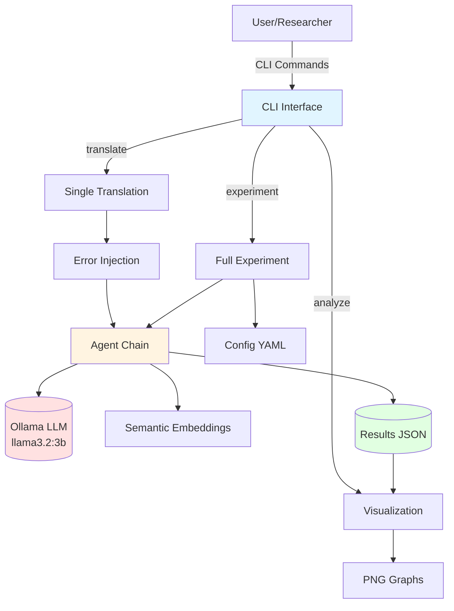
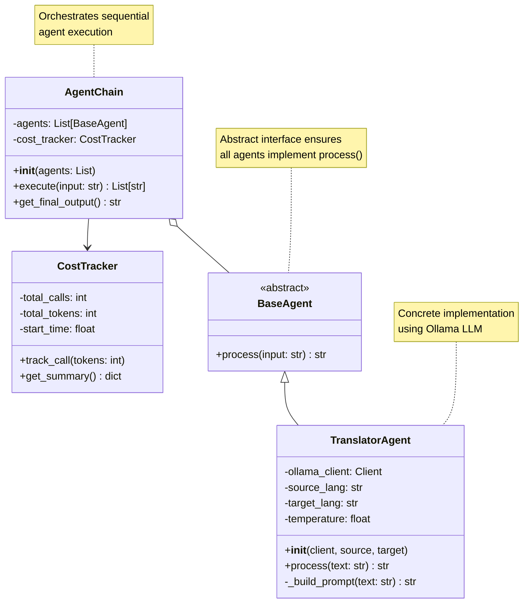
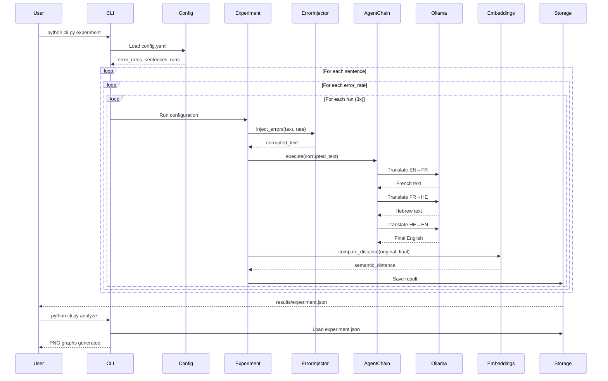
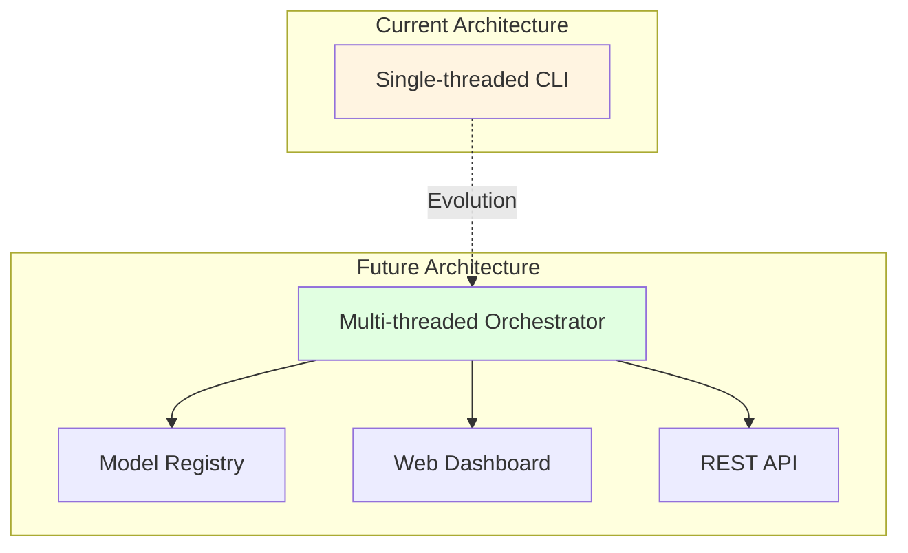

# System Architecture
## Multi-Agent Translation Analysis System

**Date:** November 24, 2025  
**Version:** 1.0  
**Authors:** Tom Ron, Igor Nazarenko, Roie Gilad

---

## Table of Contents

1. [Overview](#overview)
2. [High-Level Architecture](#high-level-architecture)
3. [Component Diagrams](#component-diagrams)
4. [Data Flow](#data-flow)
5. [Design Patterns](#design-patterns)
6. [Technology Stack](#technology-stack)

---

## Overview

The Multi-Agent Translation Analysis System implements a pipeline architecture for measuring semantic drift across multi-language translation chains. The system uses:

- **Agent Pattern**: BaseAgent abstraction for modular translation agents
- **Chain of Responsibility**: Sequential processing through AgentChain
- **Strategy Pattern**: Configurable error injection strategies
- **Observer Pattern**: Cost tracking and monitoring

---

## High-Level Architecture

### System Context Diagram



**Key Components:**

1. **CLI Interface** (Typer): User interaction layer
2. **Agent Chain**: Translation orchestration
3. **Ollama LLM**: Local language model inference
4. **Embeddings**: Sentence-BERT semantic similarity
5. **Configuration**: YAML-based experiment setup
6. **Results Storage**: JSON persistence

---

## Component Diagrams

### Diagram 1: Multi-Agent Translation Pipeline

```mermaid
flowchart LR
    subgraph Input
        Original[Original English Text]
        ErrorRate[Error Rate Config]
    end

    subgraph ErrorInjection["Error Injection Module"]
        Inject[inject_errors]
        Original --> Inject
        ErrorRate --> Inject
        Inject --> Corrupted[Corrupted Text]
    end

    subgraph AgentChain["Translation Chain"]
        Corrupted --> Agent1[TranslatorAgent 1<br/>EN → FR]
        Agent1 --> French[French Text]
        French --> Agent2[TranslatorAgent 2<br/>FR → HE]
        Agent2 --> Hebrew[Hebrew Text]
        Hebrew --> Agent3[TranslatorAgent 3<br/>HE → EN]
        Agent3 --> Final[Final English]
    end

    subgraph Analysis["Semantic Analysis"]
        Original --> Embed1[Embedding 1]
        Final --> Embed2[Embedding 2]
        Embed1 --> Distance[Cosine Distance]
        Embed2 --> Distance
        Distance --> Result[Semantic Distance]
    end

    style ErrorInjection fill:#ffe1e1
    style AgentChain fill:#fff4e1
    style Analysis fill:#e1ffe1
```



**Pipeline Stages:**

1. **Input Processing**: Original text + error rate configuration
2. **Error Injection**: Word-level corruption (see ADR-003)
3. **Translation Chain**: Three sequential agents (EN→FR→HE→EN)
4. **Semantic Analysis**: Embedding-based distance measurement
5. **Output**: Semantic distance metric (0.0 to 1.0)

---

### Diagram 2: Agent Class Hierarchy



**Design Rationale:**

- **BaseAgent**: Enforces consistent interface across all agents
- **TranslatorAgent**: Encapsulates Ollama API calls and prompt engineering
- **AgentChain**: Manages agent coordination and result tracking
- **CostTracker**: Monitors resource usage (optional, for production)

---

### Diagram 3: Experiment Orchestration Flow



**Workflow:**

1. **Initialization**: Load config (error rates, sentences, runs)
2. **Nested Loops**: 2 sentences × 6 error rates × 3 runs = 36 experiments
3. **Per Experiment**:
   - Inject errors at specified rate
   - Execute translation chain (3 Ollama calls)
   - Compute semantic distance
   - Store result
4. **Persistence**: Save all results to JSON
5. **Analysis**: Generate visualizations on demand

---

## Data Flow

### Input → Output Transformation

```
┌─────────────────────────────────────────────────────────────┐
│ INPUT                                                        │
├─────────────────────────────────────────────────────────────┤
│ • English sentence (15+ words)                              │
│ • Error rate (0.0 - 0.5)                                    │
│ • Random seed (42)                                          │
└─────────────────────────────────────────────────────────────┘
                          │
                          ▼
┌─────────────────────────────────────────────────────────────┐
│ PROCESSING                                                   │
├─────────────────────────────────────────────────────────────┤
│ 1. Error Injection (word-level replacement)                 │
│ 2. Translation EN→FR (Ollama llama3.2:3b)                  │
│ 3. Translation FR→HE (Ollama llama3.2:3b)                  │
│ 4. Translation HE→EN (Ollama llama3.2:3b)                  │
│ 5. Embedding (Sentence-BERT all-MiniLM-L6-v2)              │
│ 6. Distance (Cosine similarity)                             │
└─────────────────────────────────────────────────────────────┘
                          │
                          ▼
┌─────────────────────────────────────────────────────────────┐
│ OUTPUT                                                       │
├─────────────────────────────────────────────────────────────┤
│ • Semantic distance (float 0.0-1.0)                        │
│ • Intermediate translations (EN, FR, HE, EN)                │
│ • Metadata (error_rate, run_id, timestamp)                  │
└─────────────────────────────────────────────────────────────┘
```

### Data Structures

**Experiment Result (JSON):**

```json
{
  "sentence_id": 0,
  "error_rate": 0.2,
  "run_id": 1,
  "original": "The quick brown fox...",
  "corrupted": "The xkqp brown fox...",
  "translations": {
    "french": "Le renard brun...",
    "hebrew": "השועל החום...",
    "final_english": "The fast brown fox..."
  },
  "semantic_distance": 0.23,
  "timestamp": "2025-11-24T21:30:00Z"
}
```

---

## Design Patterns

### 1. Strategy Pattern (Error Injection)

**Intent:** Allow different error injection strategies without changing client code.

**Implementation:**
- Interface: `inject_errors(text, error_rate, seed)`
- Current strategy: Word-level random replacement
- Future strategies: Character-level, phonetic, neural

### 2. Template Method (BaseAgent)

**Intent:** Define skeleton of agent execution, let subclasses override specific steps.

**Implementation:**
```python
class BaseAgent(ABC):
    @abstractmethod
    def process(self, input_data: str) -> str:
        pass  # Subclasses implement translation logic
```

### 3. Chain of Responsibility (AgentChain)

**Intent:** Pass requests along a chain of handlers.

**Implementation:**
```python
class AgentChain:
    def execute(self, input_text: str) -> List[str]:
        current = input_text
        for agent in self.agents:
            current = agent.process(current)
        return results
```

### 4. Facade (CLI)

**Intent:** Provide simplified interface to complex subsystems.

**Implementation:**
- `translate()`: Hides error injection + agent chain + distance calculation
- `experiment()`: Hides config loading + loops + result storage
- `analyze()`: Hides data loading + matplotlib configuration

---

## Technology Stack

### Core Dependencies

| Component | Technology | Version | Purpose |
|-----------|-----------|---------|---------|
| **LLM** | Ollama (llama3.2:3b) | Latest | Translation inference |
| **Embeddings** | sentence-transformers | ≥5.1.2 | Semantic similarity |
| **CLI** | Typer | ≥0.12.0 | Command-line interface |
| **Visualization** | Matplotlib + Seaborn | ≥3.7.0 | Graph generation |
| **Configuration** | PyYAML | ≥6.0 | YAML parsing |
| **Testing** | Pytest + pytest-cov | ≥7.3.0 | Unit/integration tests |

### System Architecture

```
┌─────────────────────────────────────────────────────────┐
│                    User Interface                        │
│                  (CLI via Typer + Rich)                  │
└─────────────────────────────────────────────────────────┘
                          │
┌─────────────────────────┴───────────────────────────────┐
│                  Application Layer                       │
│  ┌─────────────┐  ┌──────────────┐  ┌──────────────┐  │
│  │ Translation │  │   Error      │  │ Experiment   │  │
│  │   Chain     │  │  Injection   │  │ Orchestration│  │
│  └─────────────┘  └──────────────┘  └──────────────┘  │
└──────────────────────────────────────────────────────────┘
                          │
┌─────────────────────────┴───────────────────────────────┐
│                    Service Layer                         │
│  ┌─────────────┐  ┌──────────────┐  ┌──────────────┐  │
│  │   Ollama    │  │ Sentence-    │  │    Cost      │  │
│  │   Client    │  │ Transformers │  │   Tracker    │  │
│  └─────────────┘  └──────────────┘  └──────────────┘  │
└──────────────────────────────────────────────────────────┘
                          │
┌─────────────────────────┴───────────────────────────────┐
│                    Data Layer                            │
│  ┌─────────────┐  ┌──────────────┐  ┌──────────────┐  │
│  │   Config    │  │   Results    │  │    Cache     │  │
│  │  (YAML)     │  │   (JSON)     │  │  (Optional)  │  │
│  └─────────────┘  └──────────────┘  └──────────────┘  │
└──────────────────────────────────────────────────────────┘
```

---

## Performance Characteristics

### Scalability

| Dimension | Current | Theoretical Limit |
|-----------|---------|-------------------|
| **Sentences** | 2 | Unbounded (config-driven) |
| **Error Rates** | 6 | Unbounded (0.0-1.0 range) |
| **Runs per Config** | 3 | Unbounded (statistical power) |
| **Total Experiments** | 36 | sentences × rates × runs |
| **Execution Time** | ~25 min | O(n) linear with experiments |

### Resource Usage

- **RAM**: ~2GB (Ollama model + embeddings)
- **Disk**: ~5MB (results + graphs)
- **CPU**: Moderate (Ollama inference dominant)
- **Network**: None (fully local)

---

## Security & Privacy

### Local-First Architecture

✅ **Advantages:**
- No data leaves local machine
- Zero API costs
- Full control over model and data
- No rate limits or quotas

⚠️ **Considerations:**
- Requires Ollama installation
- Model download (~2GB)
- No cloud backup by default

---

## Future Enhancements

### Potential Extensions

1. **Parallel Processing**: Multi-threaded experiment execution
2. **Model Comparison**: Test multiple LLMs (GPT-4, Claude, Gemini)
3. **Advanced Error Types**: Phonetic, OCR, keyboard-adjacent
4. **Real-time Dashboard**: Web UI for live monitoring
5. **API Server**: REST API for remote access

### Architecture Implications



---

## References

1. **Design Patterns**: Gang of Four (GoF) patterns applied
2. **Multi-Agent Systems**: See ADR-001 for detailed rationale
3. **Error Injection**: See ADR-003 for word-level strategy
4. **Embeddings**: See ADR-002 for model selection

---

## Change Log

### Version 1.0 (November 24, 2025)
- Initial architecture documentation
- 3 Mermaid diagrams added
- Component descriptions completed
- Design patterns documented

---

**Status:** ✅ Complete  
**Last Updated:** November 24, 2025  
**Maintainers:** Tom Ron, Igor Nazarenko, Roie Gilad
